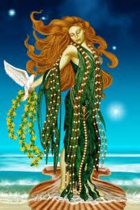

.. Greek Mythology documentation master file, created by
   sphinx-quickstart on Thu Nov 30 08:38:52 2017.
   You can adapt this file completely to your liking, but it should at least
   contain the root `toctree` directive.

Aphrodite
=========

	
	Aphrodite rising from the sea, made by `Sharon George`_.

.. _Sharon George: http://lakeareagoddessessociety.faithweb.com/aphrodite.html

Aphrodite is the goddess of love, beauty, and eternal youth. According to some 
legends, Aphrodite arose from the foam of the sea after Cronus the Titan slew 
his father, Uranus, and threw his genitals into the sea. Her beauty was 
unsurpassed, and almost started wars within the close family of the gods. 
To prevent this, Zeus ordered her to marry Hephaestus, the god of fire and 
metalworking. Even though she was married, Aphrodite had many affairs with 
other gods like Ares, and also humans. She was known to be quite vain, and 
exacted revenge on anyone who said their beauty surpassed hers. In the legend 
of the golden apple, Paris, the son of the King of Troy, chose Aphrodite as 
the fairest between Hera and Artemis. In exchange, she gave him Helen, a 
beautiful, but married woman. This story was considered to be the real reason 
for the beginning of the Trojan War.

**Aphrodite had many children including:**
* Eros
* Phobos
* Deimos 
* Harmonia
* Pothos
* Anteros
* Himeros
* Hermaphoditus
* Rhodos
* Eryx
* Peitho
* Eunomia
* The Graces
* Priapus
* Aeneas
