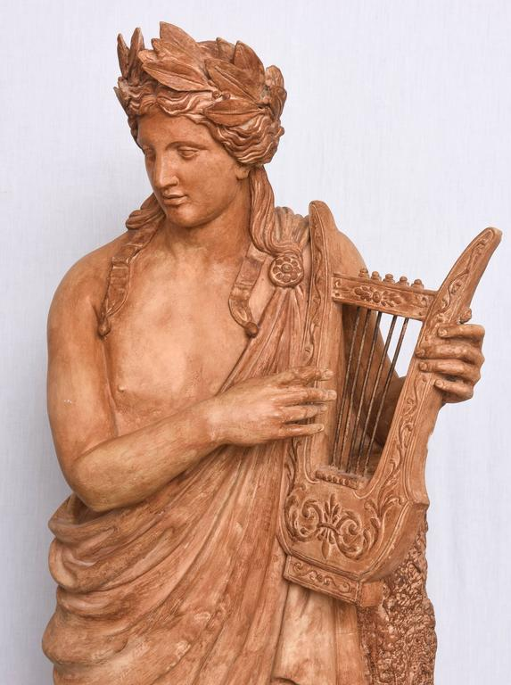

Apollo
======

    Terra Cotta Garden Statue of Apollo from the 19th Century, courtesy of `1st Dibs`_.

.. _1st Dibs: https://www.1stdibs.com/furniture/decorative-objects/sculptures/figurative-sculptures/large-scale-terra-cotta-garden-statue-greek-god-apollo-italy-19th-century/id-f_3643803/

**Apollo is the god of the sun, archery, music, poetry, art, dance, oracles, 
plague, and medicine.** Though he was the god of all music, his primary 
instrument was the lyre.  He is typically depicted with either a golden lyre or 
silver bow and arrows.  He is also always clean-shaven, young, and athletic, and
typically wearing a laurel crown.  

He and his twin sister, Artemis, are children of Zeus and the Titaness Leto.  
Leto was pursued by Hera’s jealous rage during her pregnancy and cursed to be 
unable to give birth on solid land.  The only safe place she could 
find to give birth was on the floating island of Delos.  The first thing Apollo 
did after leaving Delos was kill Python, a giant snake, that had been 
terrorizing the city of Delphi.  Once Python was dead, Apollo took control of 
the oracle in Delphi.  He was then granted the gift of prophecy.  

**Apollo and Artemis are mirrors of each other.**  Apollo is the protector of 
young boys and Artemis is the protector of young girls.  They are deities of the
sun and moon.  They are both gods of archery, but Apollo is god of *sport* 
archery and Artemis is goddess of archery for hunting and war.  

Apollo has *many* affairs with women, and there are multiple instance in which 
his advances are rejected and he punishes the women.  Once, a woman named 
Coronis was pregnant with his child but fell in love with *another* man.  Apollo 
heard this and, in anger, asked Artemis to kill Coronis.  Apollo himself once 
accidentally killed his closest friend and love interest, Hyacinthus, with a 
discus throw.  In greif, Apollo created a flower to commemorate his friend.  
Another time, a satyr, Marsyas, challenged Apollo to a music competition.  
Apollo won and was so angry he had Marsays flayed alive for being arrogant 
enough to challenge a god.  

Children of Apollo
------------------
 * Asclepius
 * Troilus
 * Aristeaus
 * Orpheus
 * Korybantes Samothrakioi
 * Ion
 * Apis
 * Linos
 * Epidauros
 * Delphos
 * Philammon
 * Anios
 * Lykomedes
 * Anios
 * Miletos
