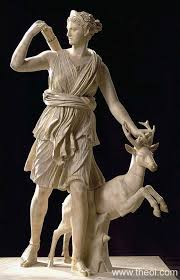

Artemis
=======

	Greco-Roman marble statue, circa 1st Century A.D., courtesy of `Theoi`_.

.. _Theoi: http://www.theoi.com/Olympios/Artemis.html

**Artemis is the goddess of the moon, the hunt, archery, wild animals, the 
wilderness, vegetation, childbirth, and chastity.**  Her sacred animal is the 
deer.  She is the daughter of the god Zeus and the Titaness Leto.  Leto 
gave birth to Artemis and her twin brother Apollo on the floating island 
of Delos because that was the only place Leto could escape from a jealous 
Hera’s tormenting.  

**Artemis and Apollo are often seen in conjunction to each other.**  They are 
patrons of unmarried girls and boys, and the moon and sun, respectively.  
Artemis’s personality was often cold, reserved, and private- opposite the 
outgoing Apollo.  However, they still often worked in conjunction with each 
other.  Once, a woman named Niobe bragged that she birthed more children than 
Leto and was therefore better.  However, when Artemis and Apollo heard this they 
shot and killed *all* her children.  

Artemis takes revenge when others try to disrespect her or spy on her.  For 
example, Actaeon, a famous hunter, once found her and some of her attendants 
bathing in a stream.  Instead of leaving, he came closer, and Artemis turned him 
into a *deer*.  Her dogs then attacked and killed him.  

Artemis was a maiden goddess and took pride in that.  In fact, she only fell in 
love on *one* occasion: with her hunting partner, Orion.  However, Apollo was 
upset by this and challenged Artemis to shoot a point way off on the horizon.
Unfortunately, the point was Orion, and Artemis shot and killed him.  In her 
grief, she made him into a constellation.  
