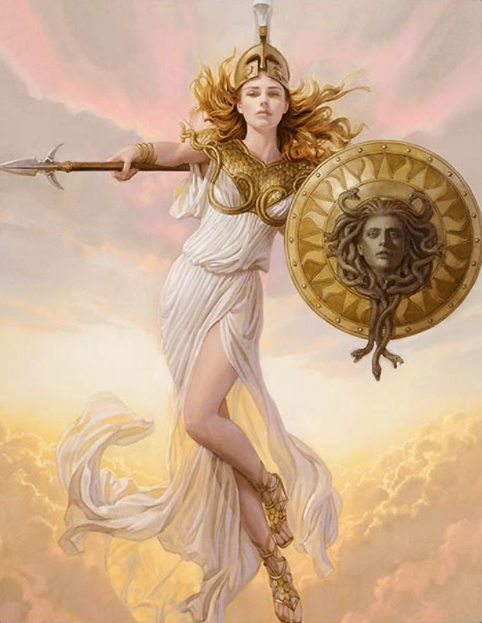

Athena
======

.. https://www.pinterest.com/explore/athena-goddess/

Athena is the goddess of wisdom and battle strategy. She is also the goddess of
war, while Are is the god of war. She was the figure soldiers prayed and made
sacrifices to when they wanted to win battles. Zeus is her father; it is said
that she started as a headache in Zeus' head and sprouted out of his head and
into the world. That is one story of her birth, and it explains the wisdom
aspect of her. She does not have a mother, and she is Zeus' favorite child.
Her symbol is an owl, as owls are a symbol of wisdom. She also wields the
magical shield Aegis, which heroes could not look at, as the head of Medusa was
used to create it. Though Artemis was the goddess known for never having a love
interest, Athena mostly kept to herself when it came to romantic relationships
with men. She did have a few demigod children, unlike Artemis, but for how
desired she was, she did not participate in many romantic encounters. This is
not much of a surprise, as she was busy with her wisdom and war doings.
