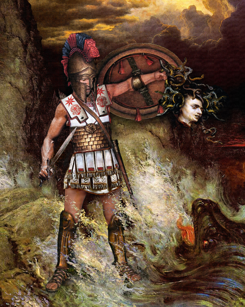

Demigods
========

 Perseus holding the head of Medusa after defeating her, `Morland Studios <http://morlandstudios.com/?attachment_id=453>`_.

Demigods are half-human, half-god beings. When a god and human have a child, the
result is a demigod. They usually have a bit of the powerfulness that gods
contain, while remaining mortal. Though it was frowned upon for gods to have
affairs with humans, they did it quite a bit in Greek Mythology. Each demigod is
in danger of whatever tragedies might strike in the mortal world, as well as the
monsters and dangers arise in the immortal world. They each, however, typically
obtain a talent or gift that their godly parent had, so they are more powerful
than regular humans, while still being *significantly* less than godly. The most
powerful and well-known ones were typically children of the "Big Three,"
particularly Zeus, since he was the head of all gods.

Here are some famous demigods in the Greek Mythology world:

============ ==============================================================
Demigod      Known For
============ ==============================================================
**Perseus**  son of Zeus, slayed Medusa, saved Andromeda
**Achilles** son of Thetis, hero in Trojan War, Achilles Heel
**Heracles** son of Zeus, strongest being (stronger than gods)
**Orpheus**  son of Apollo, used lyre to try to rescue wife from Underworld
**Jason**    unknown godly parent, successful quest for Golden Fleece
============ ==============================================================