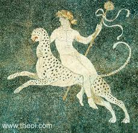

Dionysus
========

	Dionysus riding a panther, Greek Moasiac from circa 4th Century B.C., courtesy of `Theoi`_.

.. _Theoi: http://www.theoi.com/Olympios/Dionysos.html

**Dionysus is the god of wine, vegetation, pleasure, festivity, madness, 
euphoria, and the patron of Greek theater**.  He is either shown as an old 
bearded man or a young long-haired man.  He often carries a pinecone staff.  
Dionysus’ sacred animals were the panther, leopard, and tiger.  His sacred 
plants were the grapevine, ivy, and pine trees.  

Dionysus was born to Zeus and Semele, princess of Thebes.  Semele, influenced 
by a jealous Hera, asked Zeus to show her his full form but she died upon 
seeing him like that.  Zeus rescued the unborn Dionysus and *sewed him into his* 
*leg*, where he stayed until he was born.  Because Dionysus was born from Zeus, 
he was immortal despite having one mortal parent.  He is the *only* Olympian to 
have a mortal parent.  After he was born, he was raised by his Aunt Ino for a 
while, but she and her husband were cursed by Hera and killed themselves and 
their children.  

Hera then cursed Dionysus himself into madness.  He wandered around in madness 
for years, teaching people how to make wine.  Once, he was captured by 
Tyrrhenian pirates who wanted to sell him into slavery, but Dionysus cursed 
their ship with phantom vines and beasts.  In fear, the pirated jumped into the 
sea, where Dionysus turned them into dolphins.  Another time, a *different* 
group of pirates captured him, mistaking him for a prince because he looked rich.  
They tied him to the mast of the ship but he magically loosened them until they 
fell.  The pirates retied him, but Dionysus loosened the ropes again.  He turned 
into a lion and pulled the pirates into the sea with vines.  He sailed the 
nearby island of Naxos, where he found Ariadne, princess of Crete, after she had
been abandoned by Theseus.  When she died, Dionysus made a constellation of the 
crown he gave her. 

Dionysus was worshipped in the woods where his followers could be as wild and 
crazy as they wanted.  He was dramatic and had a sense of humor.  He was the 
last god to be instated on Mount Olympus.  

