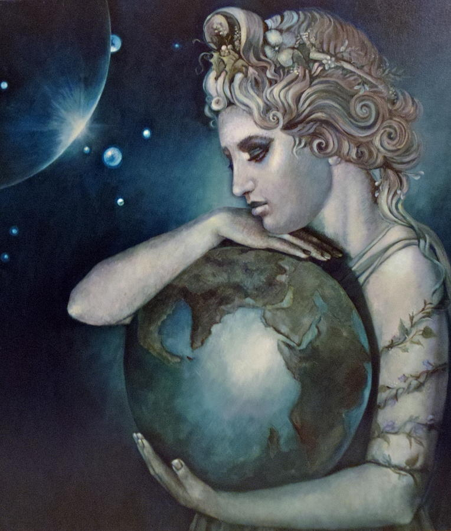

Gaea
====

	An image of Gaea, `reference`_.
.. _reference: https://ravenseniors.wikispaces.com/GL+2013+P4+Gaia

Within Greek Mythology, the thing to exist before all else was Chaos made of 
Void, Mass, and Darkness. From Chaos came earth in the form of Gaea. Referred 
to as “Mother Earth,” Gaea produced starry heavens as the God Uranus. Gaea also 
created the mountains, plains, seas, and rivers that formed Earth. 

Gaea was a primal goddess and governed the universe before the time of the 
Titans. Gaea embodied Earth and was worshipped as the universal mother. In Greek
Mythology, she gave birth to Titans and the first humans with Uranus. Uranus 
attempted to stop Gaea’s creations, and imprisoned them in Gaea’s womb. With 
this came the allegiance of Gaea and her son Cronus, and together they 
overthrew Uranus. 

Later, Gaea’s allegiance was transferred to Zeus when Cronus began swallowing 
his own children. Cronus swallowed his children to prevent them from 
overthrowing him, a prophecy told by Gaea. After overthrowing Cronus, Gaea was 
angered when Zeus threw the Titans into Tartarus. In her anger, Gaea birthed a 
tribe of Giants and eventually Typhoeus, a storm giant. Neither creation was 
able to overthrow Zeus.

For a better understanding of Chaos, click `here`_ to see a short description of
Chaos and its creations.

.. _here: https://www.greekmythology.com/Other_Gods/Chaos/chaos.html