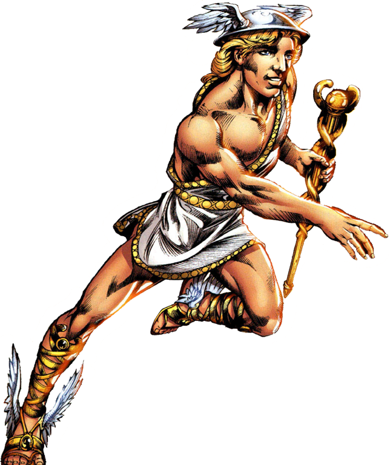

Hermes
======

Hermes off to deliver messages, `Word Hunter <https://hunterswritings.com/2016/04/19/character-archetypes-h-for-herald-and-hermes/>`_.

Hermes is known as the messenger god. He carries messages throughout the world
at high speeds for the gods. He is the son of Zeus; his mother was Maia. His
flying shoes allow him to deliver messages amongst the gods, and have also
become a symbol of him. He can be represented by the messenger bag and staff
with two snakes as well. Hermes is also known to be a god of thievery and
trickery. He was accused of stealing all of Apollo's sacred cattle. His children
are known to steal and be fairly stealthy while they are doing it. Hermes, like
other gods, had many children with mortals, even though that was heavily frowned
upon. Hermes was not a great father, either. He had many demigod children, all
of whom he did not look after much or at all.Hermes is also the only living
being who gets to enter the Underworld and exit without consequence. Everyone
else either is doomed or has to make a tough deal with Hades to get out. Hermes
is the exception, since he delivers Hades messages from the other gods. 