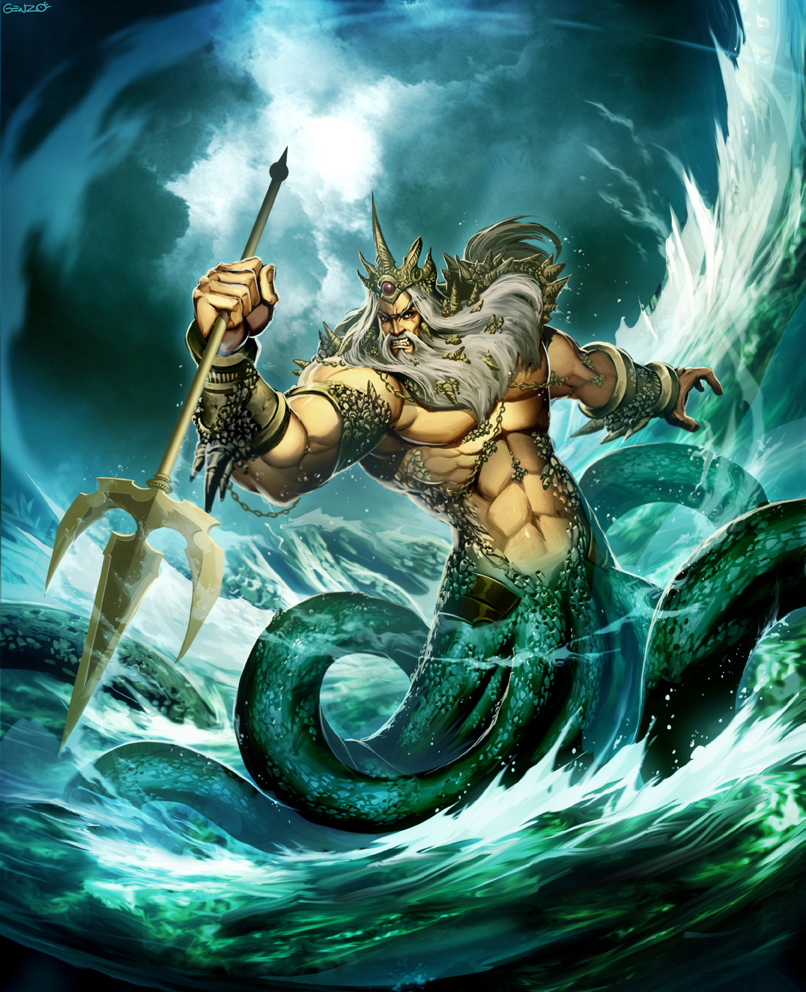

Poseidon
========

 Poseidon ruling the sea, courtesy of `Genzoman <https://genzoman.deviantart.com/art/Poseidon-God-of-the-Sea-484552876>`_.

Poseidon is the god of the sea and earthquakes. Like all of the gods, his true
godly form cannot be looked at by mortals. Poseidon's stomping grounds
outside of Mt. Olympus are all the bodies of water Earth, with his palace
located in the ocean. He is one of the "Big Three" gods, the other being his
brothers, Zeus and Hades. The "Big Three" are all the sons of the titan Cronus,
and they are seen as the most powerful of the gods. They were swallowed by their
father, got out, and worked together to kill him. His mother was Rhea, but not
many stories talk a lot about that when he had such an interesting back story
on his father. The symbol of Poseidon is a trident, as that is his go-to weapon.
He was the creator of horses and sea creatures, like dolphins and fish. He had
children of all sorts- godly children, demigods, and cyclops to new a few. His
cyclops children had sea nymph mothers, the demigods had mortal mothers, and the
kids he had with other gods obviously were completely godly themselves. Poseidon
was also known to be a grouchy and greedy god. He made sure to get revenge on
those who did him wrong.

Poseidon's Creations:
---------------------
 * horses
 * pegasi
 * zebras
 * bulls
 * dolphins
 * fish
 * camels
 * giraffes